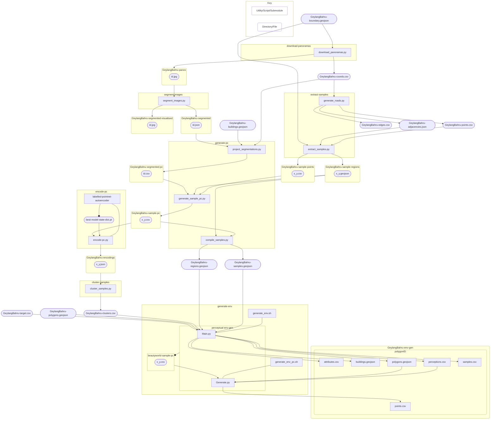

# Perceptual Urban Walk  

Execute the following utilities in order:  
1. [download-panoramas](./download-panoramas/)
2. [segment-images](./segment-images/)
3. [extract-samples](./extract-samples/)
4. [generate-pc](./generate-pc/)
5. [encode-pc](./encode-pc/)
6. [cluster-samples](./cluster-samples/)
7. [generate-pc](./generate-pc/)

A test input has been provided in [GeylangBahru/](./GeylangBahru/) with the necessary base files:  
* [GeylangBahru-boundary.geojson](./GeylangBahru/GeylangBahru-boundary.geojson)  
* [GeylangBahru-polygons.geojson](./GeylangBahru/GeylangBahru-polygons.geojson)  
* [GeylangBahru-buildings.geojson](./GeylangBahru/GeylangBahru-buildings.geojson)  
* [GeylangBahru-target.csv](./GeylangBahru/GeylangBahru-target.csv)  

The full outcome of executing all utilities on the test input can be found in the [releases](https://github.com/ccheemeng/perceptual-urban-walk/releases).  

The utilities do not always have to be run sequentially. As long as all the prerequisites are met, certain operations may be performed concurrently. Refer to the flowchart below for the required inputs and expected outputs for each utility and sub-utility.  

