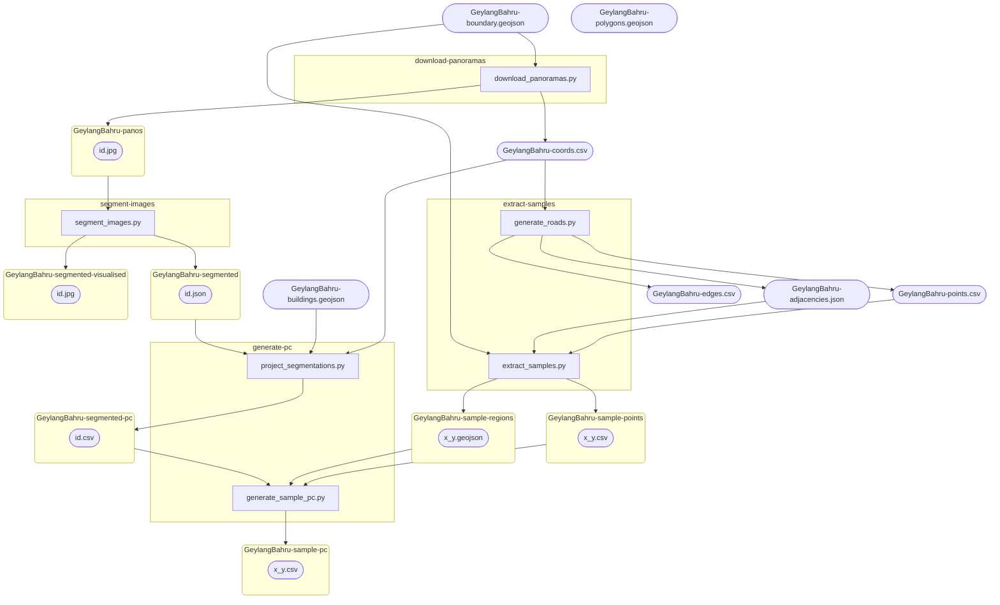

# Perceptual Urban Walk  

```mermaid
flowchart TD
    Boundary(["GeylangBahru-boundary.geojson"])
    Polygons(["GeylangBahru-polygons.geojson"])
    Buildings(["GeylangBahru-buildings.geojson"])
    Coords(["GeylangBahru-coords.csv"])
    Points(["GeylangBahru-points.csv"])
    Edges(["GeylangBahru-edges.csv"])
    Adjacencies(["GeylangBahru-adjacencies.json"])

    subgraph DP["download-panoramas"]
        DPPy["download_panoramas.py"]
        click DPPy href "https://github.com/ccheemeng/perceptual-urban-walk/tree/main/download-panoramas"
    end
    subgraph SI["segment-images"]
        SIPy["segment_images.py"]
        click SIPy href "https://github.com/ccheemeng/perceptual-urban-walk/tree/main/segment-images"
    end
    subgraph ES["extract-samples"]
        GRPy["generate_roads.py"]
        ESPy["extract_samples.py"]
        click GRPy href "https://github.com/ccheemeng/perceptual-urban-walk/tree/main/extract-samples"
        click ESPy href "https://github.com/ccheemeng/perceptual-urban-walk/tree/main/extract-samples"
    end
    subgraph GP["generate-pc"]
        PSPy["project_segmentations.py"]
        GSPPy["generate_sample_pc.py"]
        click PSPy href "https://github.com/ccheemeng/perceptual-urban-walk/tree/main/generate-pc"
        click GSPPy href "https://github.com/ccheemeng/perceptual-urban-walk/tree/main/generate-pc"
    end

    subgraph Panos["GeylangBahru-panos"]
        Pano(["id.jpg"])
    end
    subgraph Segmentations["GeylangBahru-segmented"]
        Segmentation(["id.json"])
    end
    subgraph SegmentationVizs["GeylangBahru-segmented-visualised"]
        SegmentationViz(["id.jpg"])
    end
    subgraph SamplePoints["GeylangBahru-sample-points"]
        SamplePoint(["x_y.csv"])
    end
    subgraph SampleRegions["GeylangBahru-sample-regions"]
        SampleRegion(["x_y.geojson"])
    end
    subgraph SegmentedPcs["GeylangBahru-segmented-pc"]
        SegmentedPc(["id.csv"])
    end
    subgraph SamplePcs["GeylangBahru-sample-pc"]
        SamplePc(["x_y.csv"])
    end

    Boundary --> DPPy
    DPPy --> Panos
    DPPy --> Coords
    Panos --> SIPy
    SIPy --> Segmentations
    SIPy --> SegmentationVizs
    Coords --> GRPy
    GRPy --> Points
    GRPy --> Edges
    GRPy --> Adjacencies
    Points --> ESPy
    Adjacencies --> ESPy
    Boundary --> ESPy
    ESPy --> SamplePoints
    ESPy --> SampleRegions
    Coords --> PSPy
    Segmentations --> PSPy
    Buildings --> PSPy
    PSPy --> SegmentedPcs
    SamplePoints --> GSPPy
    SampleRegions --> GSPPy
    SegmentedPcs --> GSPPy
    GSPPy --> SamplePcs

    style Panos rx:0.75vw,ry:0.75vw
    style Segmentations rx:0.75vw,ry:0.75vw
    style SegmentationVizs rx:0.75vw,ry:0.75vw
    style SamplePoints rx:0.75vw,ry:0.75vw
    style SampleRegions rx:0.75vw,ry:0.75vw
    style SegmentedPcs rx:0.75vw,ry:0.75vw
    style SamplePcs rx:0.75vw,ry:0.75vw
```